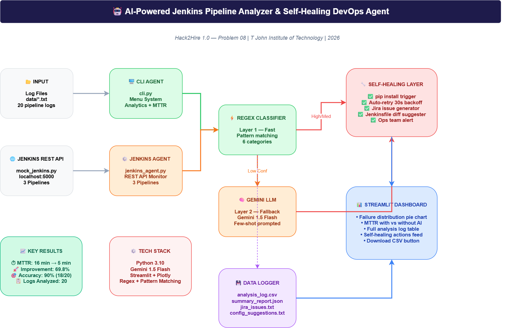

# 🤖 AI-Powered Jenkins Pipeline Analyzer & Self-Healing DevOps Agent

> Automatically detects, classifies, and heals Jenkins pipeline failures using AI — without human intervention.

[](https://python.org)
[](https://aistudio.google.com)
[](https://streamlit.io)
[](https://flask.palletsprojects.com)
[](LICENSE)
[](https://github.com)
[](https://github.com)

---

## 🎯 Problem Statement

Jenkins pipeline failures are one of the most time-consuming challenges in modern DevOps. When a build fails, engineers must manually read through dense console logs, identify the root cause, and decide on a fix — a process that takes an average of **16 minutes per failure**.

At scale, across multiple pipelines and teams, this manual overhead becomes a significant bottleneck that slows down software delivery, blocks deployments, and pulls engineers away from building features.

---

## 💡 Proposed Solution

An AI agent that connects to Jenkins via REST API, automatically fetches pipeline logs, and classifies failures into one of **6 categories** using a two-layer intelligence system:

- **Layer 1** — Fast regex pattern matching (no API call, instant)
- **Layer 2** — Google Gemini 1.5 Flash LLM fallback (for ambiguous cases)

Based on the classification, the agent immediately triggers the appropriate **self-healing action** without waiting for human input. All results are visualised in real time on a **Streamlit dashboard** that auto-refreshes every 10 seconds.

**What makes this unique:**
- Deterministic regex for speed + LLM reasoning for ambiguous cases
- Self-healing layer that goes beyond diagnosis to actually respond
- Mock Jenkins REST API makes the entire system runnable locally without real Jenkins

---

## ✅ Features

- **3 Jenkins Pipelines** — python-flaky-tests, docker-image-build, kubernetes-deploy
- **Mock Jenkins REST API** — Flask server simulating real Jenkins at localhost:5000
- **Jenkins Agent** — Fetches build info, console logs, test reports, and stage timings via REST API
- **6 Failure Categories** — Flaky Test, Dependency Issue, Infrastructure Issue, Code Defect, Configuration Error, Timeout
- **Dual Classification** — Regex Layer 1 + Gemini 1.5 Flash LLM Layer 2
- **Self-Healing Actions** — Auto-retry, pip install, Jira issue, Jenkinsfile diff, ops alert
- **MTTR Reduction** — From 16 min → 5 min (**69.8% improvement**)
- **Live Dashboard** — Pipeline health cards, failure charts, MTTR comparison, auto-refresh 10s
- **90% Accuracy** — Tested on 20 labeled logs with ground truth labels
- **Security** — API key via environment variable, never hardcoded

---

## 🏗️ Architecture / Flow


Mock Jenkins Server (mock_jenkins.py · Flask · Port 5000)
↓
Jenkins Agent (jenkins_agent.py)
Fetches: build info · console logs · test reports · stage timings · JUnit XML
↓
Regex Classifier — Layer 1 (Fast · 6 pattern categories)
↓ if Low confidence
Gemini 1.5 Flash LLM — Layer 2 (Few-shot prompted)
↓
Self-Healing Action Layer
├── Flaky Test          →  Auto-retry 30s backoff
├── Dependency Issue    →  pip install triggered
├── Infrastructure      →  Ops team alerted
├── Code Defect         →  Jira issue created
├── Config Error        →  Jenkinsfile diff saved
└── Timeout             →  Pipeline restarted 2x
↓
CSV Logger + JSON Summary + pipeline_report.json
↓
Streamlit Dashboard (auto-refresh every 10 seconds)

---

## 📁 Project Structure
AI-Powered-Jenkins-Pipeline-Analyzer/
│
├── backend/
│   ├── analyzer.py                  # Core AI classifier (Regex + Gemini LLM)
│   ├── cli.py                       # CLI agent — 5-option menu, analytics, MTTR
│   ├── mock_jenkins.py              # Mock Jenkins REST API server (Flask · Port 5000)
│   ├── jenkins_agent.py             # Agent fetching from Jenkins REST API
│   ├── analysis_log.csv             # Auto-generated full analysis history
│   ├── summary_report.json          # Auto-generated summary for dashboard
│   ├── pipeline_report.json         # Auto-generated pipeline health report
│   ├── labeled_logs.csv             # Ground truth labels — 90% accuracy report
│   ├── jira_issues.txt              # Auto-generated Jira-style issue summaries
│   └── config_suggestions.txt       # Auto-generated Jenkinsfile diff suggestions
│
├── dashboard/
│   └── app.py                       # Streamlit dashboard (auto-refresh 10s)
│
├── data/
│   ├── log1.txt                     # Dependency Issue log
│   ├── log2.txt                     # Code Defect log
│   ├── log3.txt                     # Timeout log
│   ├── log4.txt                     # Flaky Test log
│   ├── log5.txt                     # Configuration Error log
│   ├── log6.txt                     # Infrastructure Issue log
│   ├── log7.txt  — log20.txt        # Extended labeled dataset (all 6 categories)
│   ├── labeled_logs.csv             # Accuracy report ground truth
│   └── test_report.xml              # JUnit XML test report sample
│
├── architecture.png                 # System architecture diagram
├── PROJECT_BRIEF.md                 # Project summary document
├── .gitignore                       # Excludes .env, pycache, *.pyc
└── README.md

---

## 🛠️ Tech Stack

| Layer | Technology |
|---|---|
| Language | Python 3.10 |
| AI / LLM | Google Gemini 1.5 Flash |
| Classification | Regex + Pattern Matching |
| Mock Jenkins API | Flask |
| Dashboard | Streamlit + Plotly |
| Data Storage | CSV + JSON |
| Version Control | GitHub |

---

## 📅 8-Day Build Journal

> Built consistently from scratch — April 16 to April 23, 2026

| Day | Date | What We Built |
|---|---|---|
| Day 1 | Apr 16 | Project setup, GitHub repo, initial README, folder structure |
| Day 2 | Apr 17 | Multi-error log analyzer with dependency and test failure detection |
| Day 3 | Apr 18 | Multi-log analyzer with automatic failure detection from multiple files |
| Day 4 | Apr 19 | Gemini LLM integration, Streamlit dashboard, MTTR visualization, CSV logger |
| Day 5 | Apr 20 | 20 labeled logs, 90% accuracy report, architecture diagram |
| Day 6 | Apr 21 | Mock Jenkins REST API with 3 pipelines, Jenkins agent with stage timings |
| Day 7 | Apr 22 | Dashboard redesign, pipeline health cards, security fix, final README |
| Day 8 | Apr 23 | Demo video, Project Brief, final submission |

**Result: Selected Top 10 out of 52 teams at Hack2Hire 1.0** 🏆

---

## 🚀 Setup Instructions

**1. Clone the repository**
```bash
git clone https://github.com/vinaybabannavar-create/AI-Powered-Jenkins-Pipeline-Analyzer-Self-Healing-DevOps-Agent.git
cd AI-Powered-Jenkins-Pipeline-Analyzer-Self-Healing-DevOps-Agent
```

**2. Install dependencies**
```bash
pip install streamlit plotly pandas google-genai flask requests
```

**3. Set your Gemini API key**

> ⚠️ **Security note:** The API key is never stored in the codebase. Always set it as an environment variable.

```bash
# Windows
set GEMINI_API_KEY=your_api_key_here

# Mac / Linux
export GEMINI_API_KEY=your_api_key_here
```

Get a free API key at: [aistudio.google.com](https://aistudio.google.com)

**4. Start Mock Jenkins Server — Terminal 1**
```bash
cd backend
py -3.10 mock_jenkins.py
```
> Server starts at `http://localhost:5000` with 3 pipelines ready.

**5. Run Jenkins Agent — Terminal 2**
```bash
cd backend
py -3.10 jenkins_agent.py
```
> Connects to Mock Jenkins, fetches all 3 pipelines via REST API, runs AI classification, triggers self-healing actions.

**6. Run CLI Agent — Terminal 3**
```bash
cd backend
py -3.10 cli.py
```
> Choose option **1** to analyze all 20 logs.
> Choose option **4** to run the Jenkins Pipeline Agent directly from the CLI menu.

**7. Run Dashboard — Terminal 4**
```bash
cd dashboard
py -3.10 -m streamlit run app.py
```
> Open `http://localhost:8501` — auto-refreshes every 10 seconds.

---

## 📊 Results

| Metric | Value |
|---|---|
| Total logs analyzed | 20 |
| Regex classified | 18 (90%) |
| LLM classified | 2 (10%) |
| Classification accuracy | **90% (18/20)** |
| MTTR without AI | 15.05 min |
| MTTR with AI | 4.55 min |
| Improvement | **69.8% faster** |
| Pipelines monitored | 3 |
| Failure scenarios demonstrated | 6 |

### Pipeline Health

| Pipeline | Status | Issue Detected | Action Taken |
|---|---|---|---|
| python-flaky-tests | 🔴 FAILURE | Flaky Test | Auto-retry 30s backoff |
| docker-image-build | 🔴 FAILURE | Dependency Issue | pip install triggered |
| kubernetes-deploy | 🔴 FAILURE | Infrastructure Issue | Ops team alerted |

### Failure Distribution

| Category | Logs | Action Taken |
|---|---|---|
| Code Defect | 4 | Jira issue created |
| Dependency Issue | 3 | pip install triggered |
| Flaky Test | 3 | Auto-retry with backoff |
| Timeout | 3 | Pipeline restarted |
| Infrastructure Issue | 3 | Ops team alerted |
| Configuration Error | 2 | Jenkinsfile diff saved |

---

## 🎥 Demo / Screenshots

**▶ Demo Video:** [Watch Full Demo on Google Drive](https://drive.google.com/file/d/1FsUWeDLvM9FRN3ctT5psv--vgwyIZ1zm/view?usp=drivesdk).

> 3-minute walkthrough showing Mock Jenkins API running, Jenkins agent analyzing 3 pipelines, CLI analyzing 20 logs, and the live Streamlit dashboard updating in real time.

**System Architecture:**


---

## 🌐 Deployed Link

| Component | URL |
|---|---|
| Streamlit Dashboard | `http://localhost:8501` |
| Mock Jenkins API | `http://localhost:5000` |
| Jenkins API Root | `http://localhost:5000/api/json` |

---

## 🧪 Example Output

**Jenkins Agent fetching a pipeline:**
📡 Fetching pipeline: python-flaky-tests
Build #    : 5
Result     : FAILURE
Duration   : 78.2 seconds
Tests Pass : 8
Tests Fail : 2
Stages:
✅ Checkout  → SUCCESS
✅ Build     → SUCCESS
❌ Test      → FAILED
❌ Deploy    → ABORTED
🔍 AI Analysis:
Type       : Flaky Test
Confidence : High
Source     : regex
Fix        : Auto-retry the flaky stage with exponential backoff
Action     : Retrying failed stage with 30s backoff (attempt 1 of 3)

---

## 📋 Deliverables Checklist

- [x] Working agent with 6 failure classifications
- [x] Dual classification — Regex + Gemini LLM
- [x] Self-healing actions per failure type
- [x] Streamlit dashboard with live charts + auto-refresh
- [x] 20 labeled logs with 90% accuracy report
- [x] MTTR improvement — 69.8% faster resolution
- [x] CSV + JSON auto-export
- [x] Architecture diagram
- [x] Mock Jenkins REST API with 3 pipelines
- [x] Stage timings per pipeline
- [x] JUnit XML test report
- [x] Pipeline health summary
- [x] 5+ failure scenarios demonstrated
- [x] API key secured — no hardcoded secrets
- [x] Demo video recorded and uploaded
- [x] Project Brief document included
- [x] 8 days of consistent daily commits

---

## 👨‍💻 Team Members

| Name | Role | GitHub |
|---|---|---|
| Vinay Babannavar | Lead Developer — AI Classifier, Jenkins Agent, Dashboard |

---

## 📌 Hackathon

**Hack2Hire 1.0 — Problem Statement 08**
Department of Computer Science & Engineering
T John Institute of Technology | 2026

> 🏆 **Selected Top 10 out of 52 teams**

`#BuildToGetHired` `#H2H2026CSE` `#Hack2Hire`
